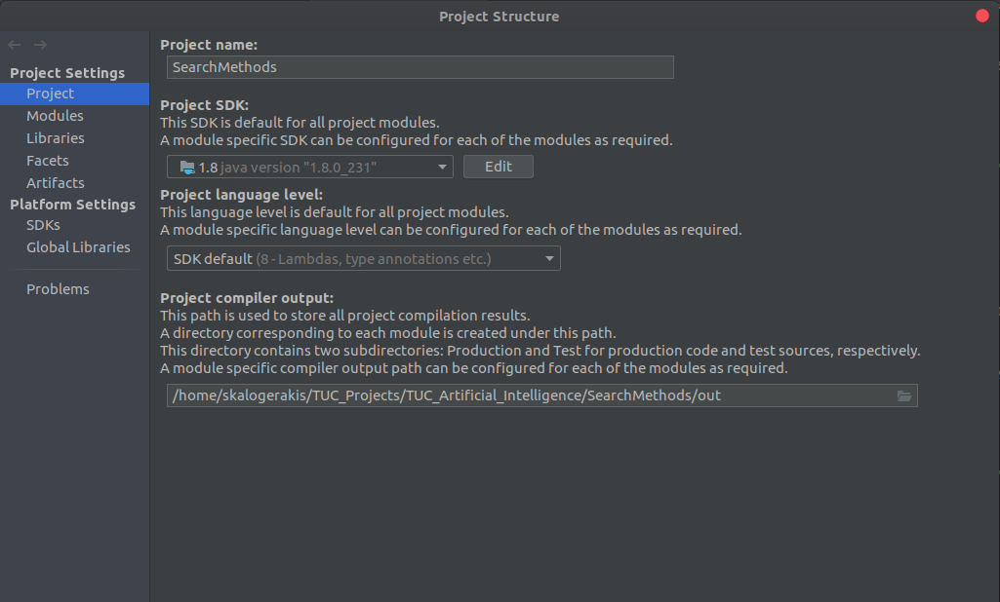
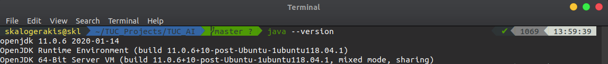
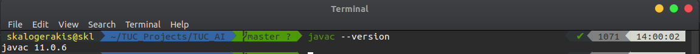

# Search Algorithm - Genetic Algorithm WHPP


My implementation of search methods DFS, BFS, A*, Online LTRA* and Genetic Algorithm WHPP 


# Execution Steps 

- Genetic Algorithm execution 

1. Go to  /Genetic-Algorithm folder
2. Simply execute java jar with file name **Genetic-Algorithm.jar**. For example execution in linux with the command 
```sh
$ java -jar Genetic-Algorithm.jar
```

- Search Methods execution

1. Go to /SearchMethods
2. Simply execute java jar with file name **SearchMethods.jar**. There is also another folder /world_examples, which inluedes some sample worlds requested in the reports .For a full example execution in linux with the command 
```sh
$ java -jar SearchMethods.jar -i world_examples/hard_b.world
```

# Java Preresiquites

The project is expected to run for every version above Java 8. Project build environment



In my system the code was executed in the following enviroment and Java configurations
- Java version


- Javac version



